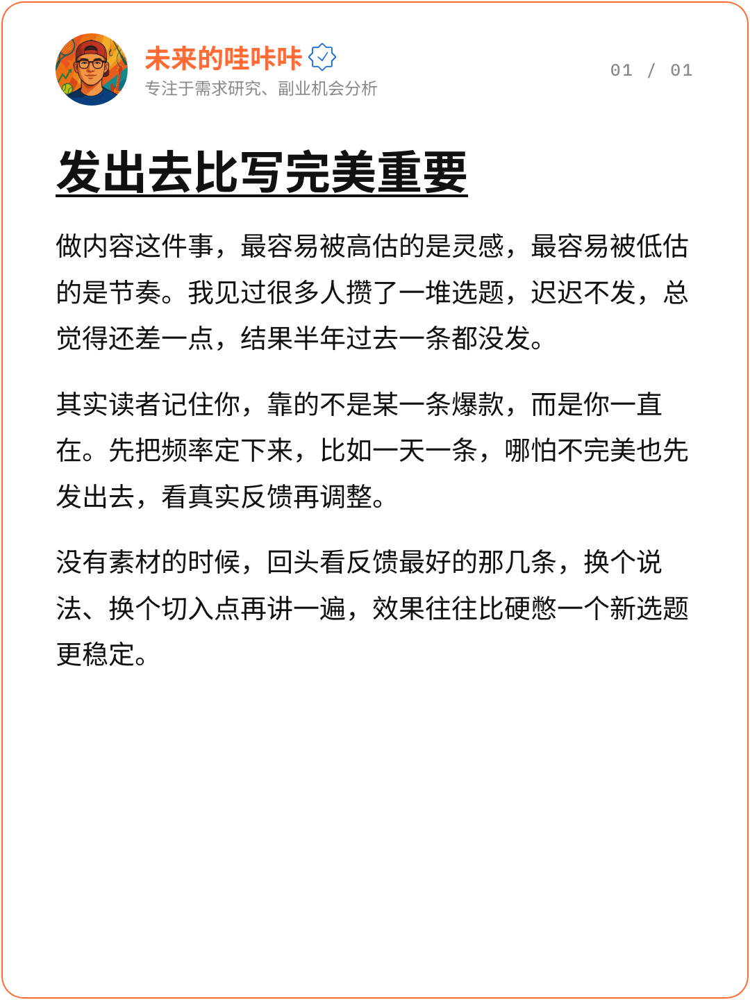

# Social Post Card

把文字做成带头像、昵称、认证图标、bio 的社交媒体卡片，两种出图模式：

- **单页短分享**：1 张纯文字卡（1 行标题 + 1–3 段正文）。你给成品文字，它只校对格式、超长删减。
- **长文分享**：1 张封面卡（大标题 + 导语 + 1 张配图）+ N 张章节卡。你给大纲和事例，它写成
  总分结构的文章，再一章一张压成卡片。

1080×1440（3:4），白底、圆角、描边+昵称固定二选一 accent 色（橙 / 蓝）。

| 长文分享 · 封面卡 | 单页短分享 / 章节卡 |
| --- | --- |
|  |  |

---

## 核心思路

**版式参数全部写死，自由度只有文案、图片、accent 颜色（橙/蓝二选一）。**

头像区、正文字号行高、图片尺寸都是固定像素值，都在 Chrome 里实测标定过。封面正文固定 4 行、
内容卡正文 6–14 行，都是由头部、标题、图片高度倒推出来的——写太少留白明显，写太多会被顶出
画布。遇到装不下，唯一的解法是改文案，不许改字号、不许改 padding。

头像、昵称、bio 是整批共用的账号身份，只在模板顶部的 `:root` 配置一次，靠 CSS 变量应用到
每一张卡，不用每张卡重复填——批量出图时不会有逐张卡不一致的问题。

---

## 安装

个人级（所有项目可用）：

```bash
git clone https://github.com/weilaidewakaka/social-post-card.git \
  ~/.claude/skills/social-post-card
```

项目级（只在当前仓库可用）：

```bash
git clone https://github.com/weilaidewakaka/social-post-card.git \
  .claude/skills/social-post-card
```

**依赖**：Node.js 18+ 和本机 Chrome / Chromium / Edge 任一。渲染脚本无 npm 依赖，
直接调用 headless 浏览器。Chrome 不在默认位置时用 `CHROME_PATH=<路径>` 指定。

克隆下来之后，把 `assets/template-post-card.html` 里 `:root` 的
`--account-avatar` / `--account-name` / `--account-bio` 三行换成你自己的账号身份
（默认值是这个仓库作者自己的账号，仅作示例）。

---

## 用法

装好之后，在 Claude Code 里直接说：

> 帮我把这段话发成一张卡片

> 这是大纲和事例，帮我做成分章节的长文卡片，封面配这张图

单页模式直接校对出图；长文模式先写一份桌面 md（卡片稿 + 文章原文）给你确认，确认后再出图。

也可以手动跑：

```bash
# 1. 复制模板
mkdir -p my-post
cp ~/.claude/skills/social-post-card/assets/template-post-card.html my-post/index.html

# 2. 填内容（规格见 references/layout-spec.md），把图片文件也放进 my-post/

# 3. 渲染前静态检查，FAIL 必须清零
node ~/.claude/skills/social-post-card/scripts/check-cards.mjs my-post/index.html

# 4. 渲染，默认导出到 ~/Desktop/my-post/
node ~/.claude/skills/social-post-card/scripts/render.mjs my-post
```

`check-cards.mjs` 检查模式组合（单页 1 张 / 长文封面 + ≥1 章节卡）、账号配置是否还是占位符、
认证图标是否存在、标题字宽、正文段落数与行数区间、页码格式与实际张数是否一致、图片是否还是占位符。渲染一轮的成本远高于改一句文案，
所以这一步在渲染之前。

> **裸模板直接跑 check 会报 FAIL，这是正常的。** 模板是待填充的种子，图片位还是占位符，
> 正文也只是提示文案，本来就不构成一张合法的卡。填完内容再跑。

---

## 不适合的场景

- 一张卡要放多张图，或图片下方还要接正文
- 要自定义版式、比例、配色

这是一个刻意收窄的工具：只有封面卡和内容卡两种卡、单页和长文两种组合，不提供别的排布。

---

## 目录结构

```
SKILL.md                          给 Claude 读的流程说明
references/layout-spec.md         全部硬性数值，动手前必读
references/content-extraction.md  文案写法：单页校对、长文写作、文风、自检
assets/template-post-card.html    自包含模板
assets/account/avatar.jpg         默认账号头像（示例，建议换成自己的）
scripts/check-cards.mjs           渲染前的静态约束检查器
scripts/render.mjs                无依赖导出器
```

---

## License

[CC BY-NC 4.0](LICENSE)。用这个 skill 做出来的卡片是你自己的作品，本协议约束的是
skill 本身。`assets/account/avatar.jpg` 是仓库作者的个人头像，不在开源许可范围内，
使用本仓库前请替换成自己的头像。
